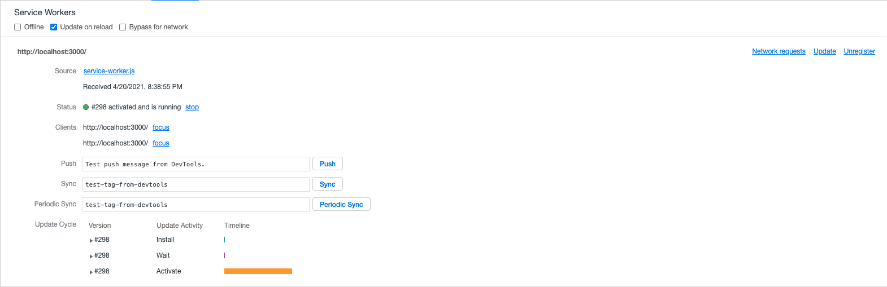
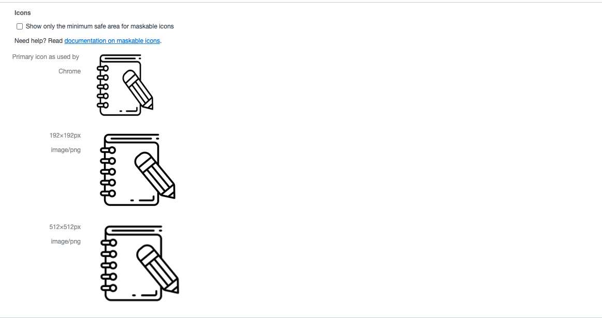
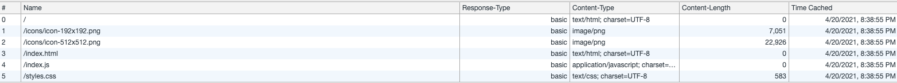
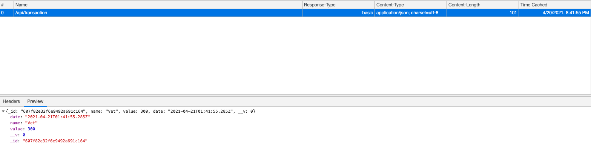

# Progressive Budget 

## Description 
The Progressive Budget applicaiton is a way for user to track their money, even when they are offline. It is pertinent to know your current balance at all times when budgeting. 

## Installation
The following image is an example of budgets the user added:

The following image is a checkpoint to make sure the browser supports service worker: 

Another helpful tool to access is [Can I Use](https://caniuse.com/) to view other browers capatibility. 

The following image displays the icons the app will use once downloaded depending on the size needed. If ran successfully, these will appear under Application -> Manifest in Chrome dev tools:

The following image displays the static cache that is generated in the service-worker.js. This is located under Application -> Cache -> Cache Storage -> Static in Chrome dev tools:

The following image displays the dynamic cache that is generated according to user input. This is located under Application -> Cache -> Cache Storage -> Dynamic in Chrome dev tools:

## User Story
AS AN avid traveller
I WANT to be able to track my withdrawals and deposits with or without a data/internet connection
SO THAT my account balance is accurate when I am traveling

## Acceptance Criteria
GIVEN a user is on Budget App without an internet connection
WHEN the user inputs a withdrawal or deposit
THEN that will be shown on the page, and added to their transaction history when their connection is back online.

## License 
MIT