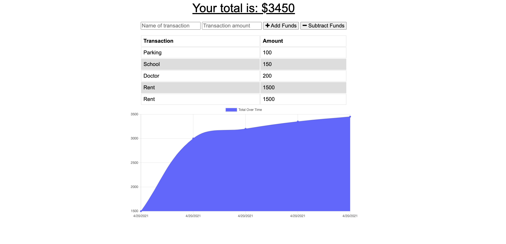

# Progressive Budget 

## Description 
The Progressive Budget applicaiton is a way for user to track their money, even when they are offline. It is pertinent to know your current balance at all times when budgeting. 

## Installation

## User Story
AS AN avid traveller
I WANT to be able to track my withdrawals and deposits with or without a data/internet connection
SO THAT my account balance is accurate when I am traveling

## Acceptance Criteria
GIVEN a user is on Budget App without an internet connection
WHEN the user inputs a withdrawal or deposit
THEN that will be shown on the page, and added to their transaction history when their connection is back online.